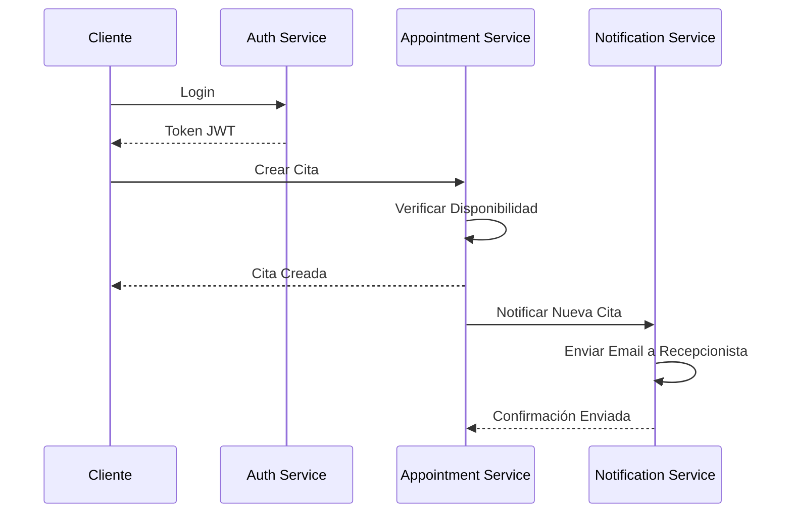
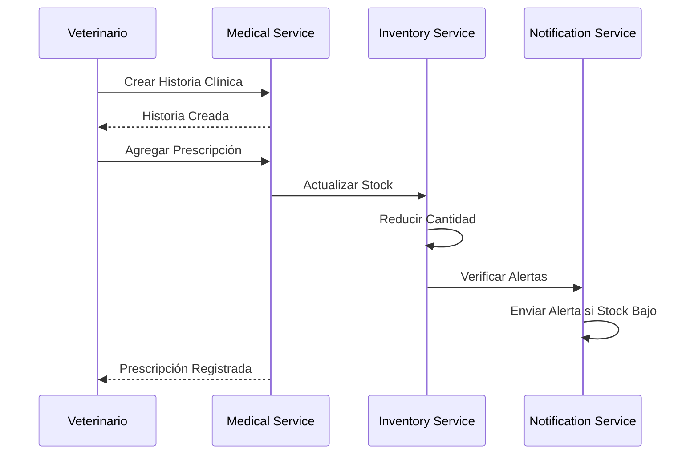
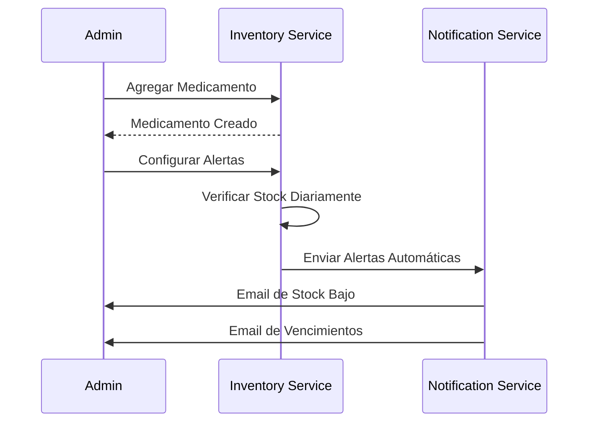

# 🐾 Sistema de Clínica Veterinaria - Testing Suite Completo

## 📋 Descripción

Este proyecto es un **sistema completo de gestión para clínica veterinaria** construido con **arquitectura de microservicios** usando Python Flask y PostgreSQL. Incluye una **aplicación de consola interactiva** que permite probar todas las funcionalidades del sistema de manera detallada.

## 🏗️ Arquitectura del Sistema

### Microservicios Principales

1. **Auth Service** (Puerto 5001) - Autenticación y autorización
2. **Medical Service** (Puerto 5004) - Gestión médica y mascotas  
3. **Inventory Service** (Puerto 5005) - Gestión de inventario y medicamentos
4. **Appointment Service** (Puerto 5002) - Gestión de citas
5. **Notification Service** (Puerto 5003) - Notificaciones y alertas

### Base de Datos
- **PostgreSQL** - Base de datos principal
- **Redis** - Cache y sesiones

## 🚀 Instalación y Configuración

### Prerequisitos

1. **Python 3.11+**
2. **Docker** (para PostgreSQL y Redis)
3. **Git**

### Paso 1: Clonar el Repositorio

```bash
git clone <repository-url>
cd veterinary_clinic_system
```

### Paso 2: Instalar Dependencias

```bash
# Instalar dependencias globales
pip install -r requirements.txt

# Instalar dependencias por microservicio
pip install -r microservices/auth_service/requirements.txt
pip install -r microservices/medical_service/requirements.txt
pip install -r microservices/inventory_service/requirements.txt
pip install -r microservices/appointment_service/requirements.txt
pip install -r microservices/notification_service/requirements.txt
```

### Paso 3: Configurar Base de Datos

```bash
# Iniciar PostgreSQL
docker run -d --name postgres-local -p 5432:5432 -e POSTGRES_DB=veterinary-system -e POSTGRES_USER=postgres -e POSTGRES_PASSWORD=bocato0731 postgres:15-alpine

# Iniciar Redis
docker run -d --name redis-local -p 6379:6379 redis:7-alpine

# Copia el archivo SQL al contenedor
docker cp database/init.sql postgres-local:/init.sql

#Ejecuta el SQL desde dentro del contenedor:
docker exec -i postgres-local psql -U postgres -d veterinary-system -f /init.sql

```


## 🎮 Uso de la Aplicación de Consola

### Iniciar la Aplicación

```bash
python veterinary_console_app.py
```

### Características Principales

#### 🔧 Gestión de Servicios
- **Iniciar/Detener** todos los microservicios automáticamente
- **Verificar estado** de cada servicio en tiempo real
- **Health checks** automáticos
- **Verificación de prerequisitos**

#### 🧪 Testing Completo por Microservicio

**Auth Service:**
- Registro de usuarios
- Login/logout
- Verificación de tokens
- Gestión de perfiles
- Cambio de contraseñas

**Medical Service:**
- Gestión de mascotas (CRUD)
- Historias clínicas completas
- Prescripciones médicas
- Resultados de exámenes
- Subida de archivos

**Inventory Service:**
- Gestión de medicamentos
- Control de stock en tiempo real
- Alertas de stock bajo
- Medicamentos próximos a vencer
- Reportes y estadísticas

**Appointment Service:**
- Creación y gestión de citas
- Verificación de disponibilidad
- Calendarios por veterinario
- Estados de citas (programada, confirmada, completada)

**Notification Service:**
- Envío de emails (simulado en desarrollo)
- Mensajes WhatsApp (simulado en desarrollo)
- Recordatorios de citas
- Alertas de inventario
- Notificaciones personalizadas

#### 🔗 Testing Avanzado

**Test de Integración Completo:**
Simula un flujo completo del sistema:
1. Registro de cliente y veterinario
2. Creación de mascota
3. Creación de medicamento
4. Agendamiento de cita
5. Creación de historia clínica
6. Prescripción con actualización automática de inventario
7. Completar cita y historia clínica
8. Envío de notificaciones

**Test de Carga:**
- Múltiples requests concurrentes
- Health checks masivos
- Registro de usuarios simultáneos
- Consultas de inventario paralelas

**Test de Conectividad:**
- Comunicación entre microservicios
- Verificación de tokens entre servicios
- Actualización de inventario desde prescripciones
- Envío de notificaciones automáticas

## 📊 Flujo de Uso Típico

### 1. Configuración Inicial

```bash
# Iniciar la aplicación de consola
python veterinary_console_app.py

# Seleccionar opción 1: Iniciar Todos los Microservicios
# La aplicación verificará prerequisitos y iniciará todos los servicios
```

### 2. Testing de Autenticación

```bash
# Ir a: Auth Service (opción 5)
# Probar:
# - Registro de usuario veterinario
# - Registro de usuario cliente  
# - Login con ambos usuarios
# - Verificación de tokens
```

### 3. Testing de Funcionalidades Médicas

```bash
# Ir a: Medical Service (opción 6)
# Crear mascota de prueba
# Crear historia clínica
# Agregar prescripciones
# Ver resumen médico
```

### 4. Testing de Inventario

```bash
# Ir a: Inventory Service (opción 7)
# Crear medicamentos
# Gestionar stock
# Ver alertas de stock bajo
# Verificar alertas de vencimiento
```

### 5. Testing de Citas

```bash
# Ir a: Appointment Service (opción 8)
# Verificar slots disponibles
# Crear citas
# Gestionar estados de citas
```

### 6. Testing de Notificaciones

```bash
# Ir a: Notification Service (opción 9)
# Probar envío de emails
# Probar recordatorios de citas
# Enviar alertas de inventario
```

### 7. Test de Integración Completo

```bash
# Seleccionar opción 10: Test de Integración Completo
# Este test ejecuta automáticamente un flujo completo
# simulando el uso real del sistema
```

## 🎯 Casos de Uso Simulados

### Cliente (Propietario de Mascota)
```bash
# 1. Registrarse en el sistema
# 2. Agregar información de su mascota
# 3. Agendar cita veterinaria
# 4. Recibir recordatorios
# 5. Ver historia clínica de su mascota
```

### Veterinario
```bash
# 1. Login en el sistema
# 2. Ver calendario de citas
# 3. Crear/actualizar historias clínicas
# 4. Prescribir medicamentos
# 5. Completar consultas
# 6. Verificar disponibilidad de medicamentos
```

### Recepcionista
```bash
# 1. Gestionar citas de clientes
# 2. Registrar nuevos clientes
# 3. Confirmar asistencia a citas
# 4. Generar facturas
# 5. Imprimir historias clínicas
```

### Administrador
```bash
# 1. Gestionar personal de la clínica
# 2. Controlar inventario completo
# 3. Ver reportes y estadísticas
# 4. Configurar alertas del sistema
# 5. Supervisar todas las operaciones
```

## 🔍 Debugging y Monitoreo

### Ver Logs en Tiempo Real

```bash
# La aplicación muestra logs coloridos de todos los servicios
# Cada request HTTP se muestra con:
# - Método y URL
# - Datos enviados
# - Código de respuesta
# - Respuesta completa
```

### Health Checks

```bash
# Verificar estado de servicios individuales:
curl http://localhost:5001/health  # Auth Service
curl http://localhost:5002/health  # Appointment Service
curl http://localhost:5003/health  # Notification Service
curl http://localhost:5004/health  # Medical Service
curl http://localhost:5005/health  # Inventory Service
```

### Verificar Base de Datos

```bash
# Conectar a PostgreSQL
docker exec -it postgres-local psql -U postgres -d veterinary-system

# Ver tablas
\dt

# Ver usuarios de prueba
SELECT * FROM users WHERE email LIKE '%test%';

# Ver medicamentos
SELECT * FROM medications;

# Ver citas
SELECT * FROM appointments;
```

## 🛠️ Configuración Avanzada

### Variables de Entorno

```bash
# Base de datos
POSTGRES_HOST=localhost
POSTGRES_DB=veterinary-system
POSTGRES_USER=postgres
POSTGRES_PASSWORD=bocato0731
POSTGRES_PORT=5432

# Flask
FLASK_ENV=development
FLASK_DEBUG=1

# Redis
REDIS_URL=redis://localhost:6379

# Servicios
AUTH_SERVICE_URL=http://localhost:5001
APPOINTMENT_SERVICE_URL=http://localhost:5002
NOTIFICATION_SERVICE_URL=http://localhost:5003
MEDICAL_SERVICE_URL=http://localhost:5004
INVENTORY_SERVICE_URL=http://localhost:5005
```

### Configuración de Notificaciones

Para habilitar notificaciones reales en producción:

```bash
# Email (Gmail)
GMAIL_USER=tu-email@gmail.com
GMAIL_PASSWORD=tu-contraseña-app

# WhatsApp (Twilio)
TWILIO_ACCOUNT_SID=tu-account-sid
TWILIO_AUTH_TOKEN=tu-auth-token
TWILIO_PHONE_NUMBER=+1234567890
```

## 🚨 Troubleshooting

### Problemas Comunes

**1. Error de conexión a PostgreSQL**
```bash
# Verificar que el contenedor esté ejecutándose
docker ps | grep postgres

# Reiniciar PostgreSQL si es necesario
docker restart postgres-local
```

**2. Error de conexión a Redis**
```bash
# Verificar Redis
docker ps | grep redis

# Reiniciar Redis
docker restart redis-local
```

**3. Puerto ya en uso**
```bash
# Verificar qué está usando el puerto
lsof -i :5001

# Matar proceso si es necesario
kill -9 <PID>
```

**4. Error de dependencias**
```bash
# Reinstalar dependencias
pip install --upgrade -r requirements.txt
```

### Logs de Debug

```bash
# Los microservicios generan logs detallados
# Ver logs de un servicio específico:
cd microservices/auth_service
python main.py

# Los logs mostrarán:
# - Conexiones a base de datos
# - Requests HTTP recibidos
# - Errores y excepciones
# - Estados de respuesta
```

## 📁 Estructura del Proyecto

```
veterinary_clinic_system/
├── veterinary_console_app.py          # 🎮 Aplicación principal de testing
├── main_principal.py                  # 🚀 Gestor de microservicios (alternativo)
├── start_all.py                      # 🔧 Iniciador simple de servicios
├── requirements.txt                   # 📦 Dependencias globales
├── README.md                         # 📖 Esta documentación
│
├── microservices/                    # 🏗️ Microservicios
│   ├── auth_service/                 # 🔐 Servicio de Autenticación
│   │   ├── app/
│   │   │   ├── models/user.py
│   │   │   ├── routes/auth_routes.py
│   │   │   └── services/auth_service.py
│   │   ├── main.py
│   │   ├── config.py
│   │   ├── requirements.txt
│   │   └── Dockerfile
│   │
│   ├── medical_service/              # 🏥 Servicio Médico
│   │   ├── app/
│   │   │   ├── models/
│   │   │   │   ├── pet.py
│   │   │   │   └── medical_record.py
│   │   │   ├── routes/medical_routes.py
│   │   │   └── services/medical_service.py
│   │   ├── main.py
│   │   ├── config.py
│   │   ├── requirements.txt
│   │   └── Dockerfile
│   │
│   ├── inventory_service/            # 📦 Servicio de Inventario
│   │   ├── app/
│   │   │   ├── models/medication.py
│   │   │   ├── routes/inventory_routes.py
│   │   │   └── services/inventory_service.py
│   │   ├── main.py
│   │   ├── config.py
│   │   ├── requirements.txt
│   │   └── Dockerfile
│   │
│   ├── appointment_service/          # 📅 Servicio de Citas
│   │   ├── app/
│   │   │   ├── models/
│   │   │   │   ├── appointment.py
│   │   │   │   └── schedule.py
│   │   │   ├── routes/appointment_routes.py
│   │   │   └── services/appointment_service.py
│   │   ├── main.py
│   │   ├── config.py
│   │   ├── requirements.txt
│   │   └── Dockerfile
│   │
│   └── notification_service/         # 📧 Servicio de Notificaciones
│       ├── app/
│       │   ├── models/notification.py
│       │   ├── routes/notification_routes.py
│       │   └── services/
│       │       ├── email_service.py
│       │       └── whatsapp_service.py
│       ├── main.py
│       ├── config.py
│       ├── requirements.txt
│       └── Dockerfile
│
├── database/                         # 🗄️ Base de Datos
│   └── init.sql                     # Script de inicialización
│
├── utils/                           # 🔧 Utilidades
│   ├── logger.py
│   └── health_check.py
│
├── scripts/                         # 📜 Scripts auxiliares
│   ├── start_dev.sh
│   ├── stop_dev.sh
│   ├── test_*.sh
│   └── insert_sample_data.sh
│
├── docker-compose.yml               # 🐳 Docker Compose producción
├── docker-compose.dev.yml          # 🐳 Docker Compose desarrollo
└── Makefile                        # ⚙️ Automatización de tareas
```

## 🧪 Casos de Prueba Detallados

### Auth Service - Casos de Prueba

```bash
✅ Registro de usuario cliente
✅ Registro de usuario veterinario
✅ Registro de usuario recepcionista
✅ Registro de usuario administrador
✅ Login con credenciales válidas
❌ Login con credenciales inválidas
✅ Verificación de token válido
❌ Verificación de token expirado
✅ Actualización de perfil
✅ Cambio de contraseña
❌ Cambio de contraseña con contraseña incorrecta
✅ Health check del servicio
```

### Medical Service - Casos de Prueba

```bash
✅ Crear mascota con datos completos
✅ Crear mascota con datos mínimos
❌ Crear mascota sin datos requeridos
✅ Buscar mascotas por nombre
✅ Buscar mascotas por microchip
✅ Actualizar información de mascota
✅ Subir foto de mascota (simulado)
✅ Crear historia clínica
✅ Actualizar historia clínica
✅ Completar historia clínica
✅ Agregar prescripción
✅ Agregar resultado de examen
✅ Ver resumen médico
✅ Ver historias por mascota
```

### Inventory Service - Casos de Prueba

```bash
✅ Crear medicamento
✅ Actualizar información de medicamento
✅ Buscar medicamentos
✅ Agregar stock (compra)
✅ Reducir stock (prescripción)
✅ Ver movimientos de stock
✅ Verificar alertas de stock bajo
✅ Verificar medicamentos próximos a vencer
✅ Generar reportes de movimientos
✅ Ver estadísticas del inventario
✅ Exportar datos a CSV (simulado)
✅ Verificar categorías de medicamentos
```

### Appointment Service - Casos de Prueba

```bash
✅ Verificar slots disponibles
✅ Crear cita en horario disponible
❌ Crear cita en horario ocupado
✅ Confirmar cita
✅ Cancelar cita
✅ Completar cita
✅ Actualizar información de cita
✅ Ver citas por veterinario
✅ Ver citas por cliente
✅ Ver citas del día actual
✅ Reprogramar cita
```

### Notification Service - Casos de Prueba

```bash
✅ Enviar email de prueba (simulado)
✅ Enviar WhatsApp de prueba (simulado)
✅ Recordatorio de cita por email
✅ Recordatorio de cita por WhatsApp
✅ Alerta de nueva cita a recepcionistas
✅ Alerta de stock bajo
✅ Alerta de medicamentos próximos a vencer
✅ Confirmación de cita
✅ Cancelación de cita
✅ Gestión de notificaciones por usuario
```

## 🔄 Flujos de Integración

### Flujo 1: Nueva Cita Completa



### Flujo 2: Consulta Médica con Prescripción



### Flujo 3: Gestión de Inventario



## 🎯 Objetivos de Testing

### Funcionalidad
- ✅ Todos los endpoints responden correctamente
- ✅ Validaciones de datos funcionan
- ✅ Manejo de errores es apropiado
- ✅ Comunicación entre servicios funciona

### Performance
- ✅ Health checks responden en < 1 segundo
- ✅ CRUD operations completan en < 2 segundos
- ✅ Búsquedas responden en < 3 segundos
- ✅ Reportes generan en < 5 segundos

### Integración
- ✅ Auth tokens funcionan entre servicios
- ✅ Actualización de inventario desde prescripciones
- ✅ Notificaciones automáticas se envían
- ✅ Estados de citas se sincronizan

### Robustez
- ✅ Sistema maneja múltiples requests concurrentes
- ✅ Recuperación automática de errores temporales
- ✅ Validación de datos en todos los niveles
- ✅ Logging completo para debugging

## 🚀 Siguientes Pasos (Desarrollo Futuro)

### Frontend Web
```bash
# El testing suite simula perfectamente lo que hará el frontend
# Casos de uso probados pueden trasladarse directamente a:
# - React.js application
# - Vue.js application  
# - Angular application
```

### API Gateway
```bash
# Implementar un gateway unificado que:
# - Enrute requests a microservicios
# - Maneje autenticación centralizada
# - Implemente rate limiting
# - Agregue logging centralizado
```

### Monitoreo en Producción
```bash
# Agregar herramientas de monitoreo:
# - Prometheus para métricas
# - Grafana para dashboards
# - ELK Stack para logs
# - Alertas automáticas
```

### Escalabilidad
```bash
# Preparar para escalamiento:
# - Kubernetes deployment
# - Load balancers
# - Database clustering
# - Caching distribuido
```

## 👥 Roles y Permisos Simulados

### Cliente (client)
- ✅ Ver sus propias mascotas
- ✅ Agendar citas
- ✅ Ver sus historias clínicas (solo lectura)
- ❌ No puede ver datos de otros clientes

### Veterinario (veterinarian)
- ✅ Ver calendario de citas
- ✅ Crear/editar historias clínicas
- ✅ Prescribir medicamentos
- ✅ Ver inventario (consulta)
- ❌ No puede gestionar personal

### Recepcionista (receptionist)
- ✅ Gestionar todas las citas
- ✅ Registrar nuevos clientes
- ✅ Ver historias clínicas (solo lectura)
- ✅ Generar facturas
- ✅ Consultar inventario

### Auxiliar (auxiliary)
- ✅ Ver calendarios
- ✅ Consultar historias (solo lectura)
- ✅ Consultar inventario
- ❌ Permisos limitados de edición

### Administrador (admin)
- ✅ Acceso completo a todo el sistema
- ✅ Gestionar personal
- ✅ Configurar horarios
- ✅ Control total de inventario
- ✅ Ver todos los reportes

## 📞 Soporte y Contribución

### Reportar Problemas
1. Describir el problema detalladamente
2. Incluir logs relevantes
3. Especificar pasos para reproducir
4. Indicar entorno (OS, Python version, etc.)

### Contribuir al Proyecto
1. Fork del repositorio
2. Crear branch para nueva funcionalidad
3. Hacer testing completo con la consola
4. Documentar cambios
5. Crear pull request

### Contacto
- 📧 Email: desarrollo@veterinariaclinic.com
- 📱 WhatsApp: +1234567890
- 🌐 Website: https://veterinariaclinic.com

---

## 🎉 ¡Felicidades!

Has completado la configuración del **Sistema de Clínica Veterinaria** con testing completo. La aplicación de consola te permite:

- **🧪 Probar todas las funcionalidades** sin necesidad de frontend
- **🔍 Debuggear problemas** con logs detallados
- **⚡ Simular usuarios reales** con diferentes roles
- **🔗 Verificar integración** entre microservicios
- **📊 Generar datos de prueba** para desarrollo

El sistema está **listo para integrar con cualquier frontend** ya que todas las APIs han sido probadas exhaustivamente.

**¡Que disfrutes desarrollando! 🚀**